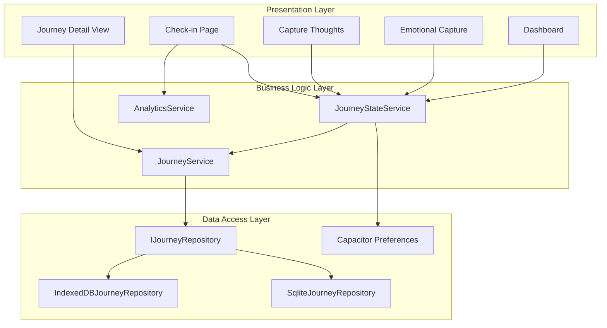
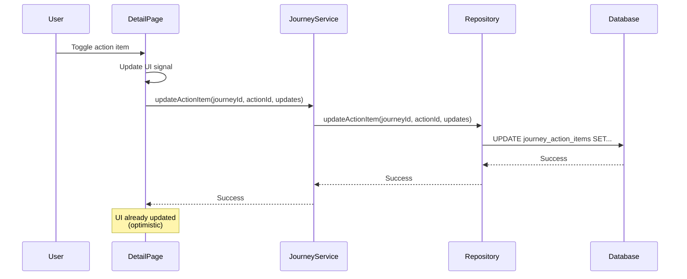
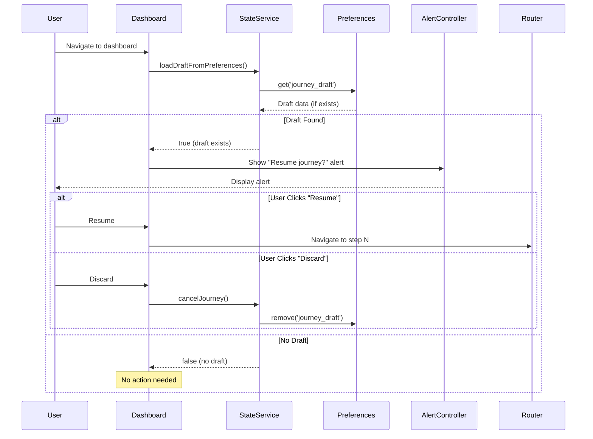
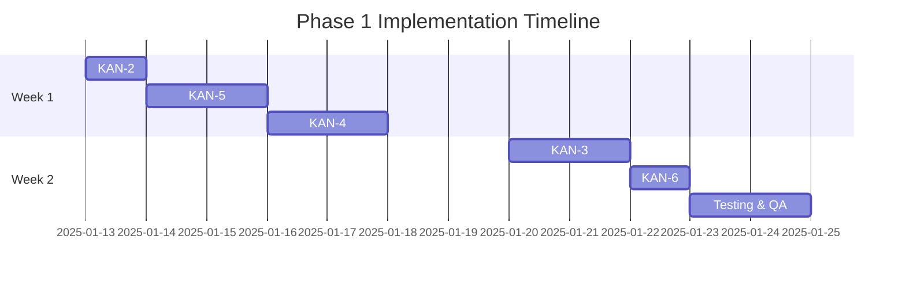
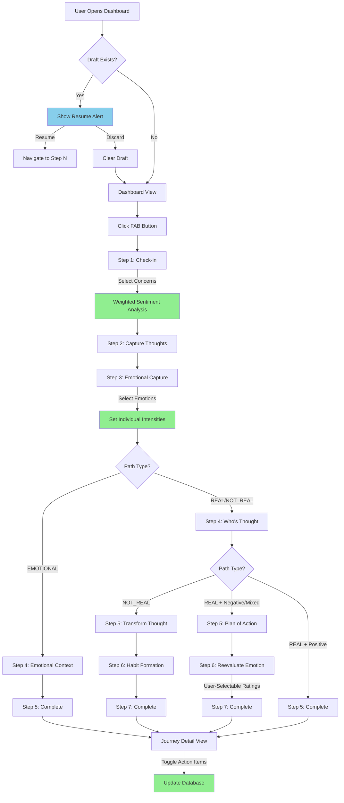
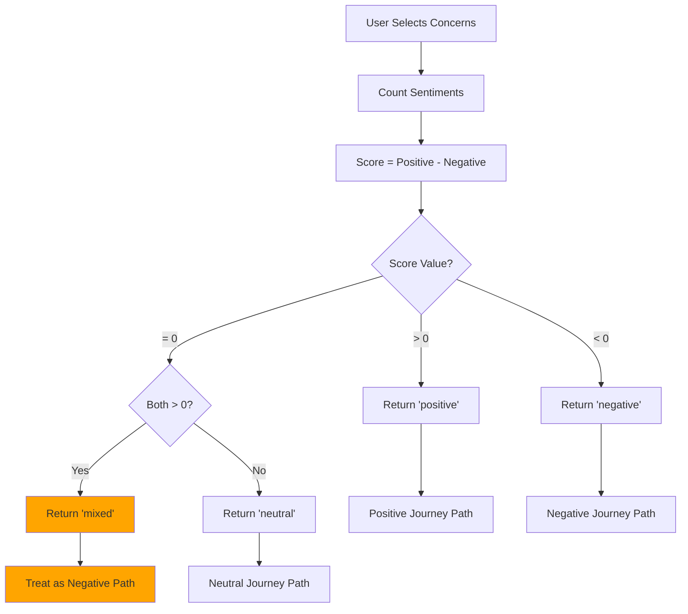
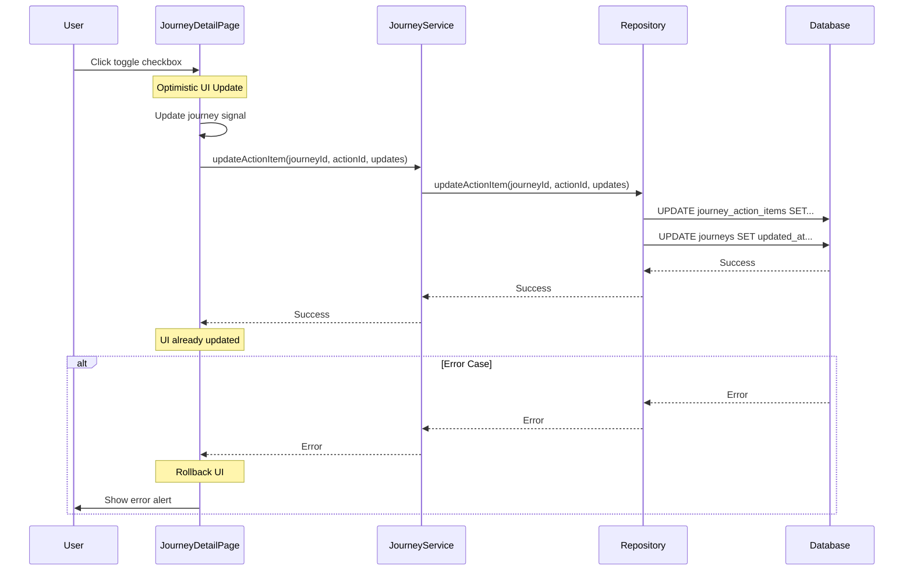

# Phase 1: Foundation Fixes - Journey Flow Optimization
## Technical Architecture Document

**Project:** Mind Atlas
**Version:** 1.0
**Date:** 2025-11-21
**Epic:** KAN-1
**Duration:** Week 1-2 (40 hours)
**Status:** Design Complete - Ready for Implementation

---

## Table of Contents

1. [Executive Summary](#executive-summary)
2. [Architecture Overview](#architecture-overview)
3. [Technical Specifications by Task](#technical-specifications-by-task)
4. [Data Model Changes](#data-model-changes)
5. [Implementation Sequence](#implementation-sequence)
6. [Testing Strategy](#testing-strategy)
7. [Deployment Considerations](#deployment-considerations)
8. [Appendices](#appendices)

---

## 1. Executive Summary

### 1.1 Overview

Phase 1 addresses critical functionality gaps and therapeutic accuracy issues in the Mind Atlas journey flow. These fixes ensure data persistence, accurate belief tracking, proper sentiment analysis, and improved user experience through draft recovery.

### 1.2 Architectural Style

**Layered Architecture** with clear separation:
- **Presentation Layer:** Ionic components in `features/`
- **Business Logic Layer:** Services in `core/services/` and feature-specific services
- **Data Access Layer:** Repository pattern with IndexedDB (web) and SQLite (native)

### 1.3 Technical Stack

- **Framework:** Angular 20 (standalone components, signals-first)
- **Mobile UI:** Ionic 8
- **State Management:** Angular Signals (primary), RxJS (HTTP only)
- **Data Persistence:** IndexedDB (web), SQLite (native via Capacitor)
- **Native Bridge:** Capacitor (Preferences for draft storage)

### 1.4 Fixes Summary

| Task | Impact | Complexity | Risk |
|------|--------|------------|------|
| KAN-2: Action Item Persistence | High | Low | Low |
| KAN-3: User-Selectable Ratings | Critical | Medium | Medium |
| KAN-4: Weighted Sentiment | High | Medium | Low |
| KAN-5: Individual Emotion Intensities | Medium | Medium | Low |
| KAN-6: Draft Recovery UI | High | Low | Low |

---

## 2. Architecture Overview

### 2.1 Current Journey Flow Architecture



### 2.2 Data Flow: Current vs. Fixed

**Current Issues:**
1. Action item toggles update UI only (no persistence)
2. Reevaluation ratings hardcoded (not user-selectable)
3. Sentiment determination priority-based (positive overrides negative)
4. All emotions share single intensity value
5. Draft recovery exists but no UI prompts user

**After Phase 1:**
All gaps closed, therapeutic accuracy improved, better UX through draft prompts.

---

## 3. Technical Specifications by Task

### 3.1 KAN-2: Fix Action Item Persistence

**Problem:** Action item completion toggles only update UI, changes lost on navigation.

**Location:** `/Users/noelf/Develop/mind-atlas/src/app/features/journey-detail/journey-detail.page.ts:160-163`

#### 3.1.1 Architecture Changes



#### 3.1.2 Repository Interface Extension

**File:** `/Users/noelf/Develop/mind-atlas/src/app/core/interfaces/journey-repository.interface.ts`

```typescript
export interface IJourneyRepository {
  // ... existing methods ...

  /**
   * Update a specific action item
   * @param journeyId - ID of the journey
   * @param actionItemId - ID of the action item
   * @param updates - Partial updates to apply
   */
  updateActionItem(
    journeyId: string,
    actionItemId: number,
    updates: Partial<ActionItem>
  ): Promise<void>;
}
```

#### 3.1.3 IndexedDB Implementation

**File:** `/Users/noelf/Develop/mind-atlas/src/app/core/repositories/indexeddb/indexeddb-journey.repository.ts`

Add method after `deleteAllJourneys()`:

```typescript
async updateActionItem(
  journeyId: string,
  actionItemId: number,
  updates: Partial<ActionItem>
): Promise<void> {
  const actionItem = await db.journey_action_items.get(actionItemId);

  if (!actionItem || actionItem.journey_id !== journeyId) {
    throw new Error(`Action item ${actionItemId} not found for journey ${journeyId}`);
  }

  // Apply updates
  const updated = {
    ...actionItem,
    ...updates
  };

  // If marking as completed, set completed_at timestamp
  if (updates.is_completed === true && !actionItem.is_completed) {
    updated.completed_at = Date.now();
  }

  // If unmarking as completed, clear completed_at
  if (updates.is_completed === false && actionItem.is_completed) {
    updated.completed_at = undefined;
  }

  await db.journey_action_items.put(updated);

  // Update parent journey's updated_at timestamp
  await db.journeys.update(journeyId, { updated_at: Date.now() });

  console.log('[IndexedDB] Action item updated:', actionItemId);
}
```

#### 3.1.4 SQLite Implementation

**File:** `/Users/noelf/Develop/mind-atlas/src/app/core/repositories/sqlite/sqlite-journey.repository.ts`

Add method after `deleteAllJourneys()`:

```typescript
async updateActionItem(
  journeyId: string,
  actionItemId: number,
  updates: Partial<ActionItem>
): Promise<void> {
  // First, verify the action item exists and belongs to this journey
  const checkSql = `
    SELECT id FROM journey_action_items
    WHERE id = ? AND journey_id = ?
  `;
  const existing = await this.db.executeQuery<any>(checkSql, [actionItemId, journeyId]);

  if (existing.length === 0) {
    throw new Error(`Action item ${actionItemId} not found for journey ${journeyId}`);
  }

  // Build dynamic UPDATE statement based on provided updates
  const updateFields: string[] = [];
  const values: any[] = [];

  if (updates.action_text !== undefined) {
    updateFields.push('action_text = ?');
    values.push(updates.action_text);
  }

  if (updates.is_completed !== undefined) {
    updateFields.push('is_completed = ?');
    values.push(updates.is_completed ? 1 : 0);

    // Handle completed_at automatically
    if (updates.is_completed) {
      updateFields.push('completed_at = ?');
      values.push(Date.now());
    } else {
      updateFields.push('completed_at = NULL');
    }
  }

  if (updates.target_date !== undefined) {
    updateFields.push('target_date = ?');
    values.push(updates.target_date);
  }

  if (updateFields.length === 0) {
    console.warn('No fields to update for action item');
    return;
  }

  // Add WHERE clause values
  values.push(actionItemId);

  const updateSql = `
    UPDATE journey_action_items
    SET ${updateFields.join(', ')}
    WHERE id = ?
  `;

  // Execute update in transaction with parent journey timestamp update
  await this.db.executeBatch([
    {
      statement: updateSql,
      values: values
    },
    {
      statement: 'UPDATE journeys SET updated_at = ? WHERE id = ?',
      values: [Date.now(), journeyId]
    }
  ]);

  console.log('[SQLite] Action item updated:', actionItemId);
}
```

#### 3.1.5 Service Layer Update

**File:** `/Users/noelf/Develop/mind-atlas/src/app/features/thought-journey/services/journey.service.ts`

Add method after `deleteAllJourneys()`:

```typescript
async updateActionItem(
  journeyId: string,
  actionItemId: number,
  updates: Partial<ActionItem>
): Promise<void> {
  return this.repository.updateActionItem(journeyId, actionItemId, updates);
}
```

#### 3.1.6 Component Update

**File:** `/Users/noelf/Develop/mind-atlas/src/app/features/journey-detail/journey-detail.page.ts`

Replace `toggleActionCompletion()` method (lines 134-163):

```typescript
async toggleActionCompletion(actionItem: ActionItem) {
  const journey = this.journey();
  if (!journey || !journey.actionItems || !actionItem.id) return;

  // Update UI immediately (optimistic update)
  const updatedActionItems = journey.actionItems.map(item => {
    if (item.id === actionItem.id) {
      return {
        ...item,
        is_completed: !item.is_completed,
        completed_at: !item.is_completed ? Date.now() : undefined
      };
    }
    return item;
  });

  const updatedJourney = {
    ...journey,
    actionItems: updatedActionItems,
    updated_at: Date.now()
  };

  this.journey.set(updatedJourney);

  // Persist to database
  try {
    await this.journeyService.updateActionItem(
      journey.id,
      actionItem.id,
      {
        is_completed: !actionItem.is_completed
      }
    );
    console.log('✅ Action item persisted:', actionItem.id);
  } catch (error) {
    console.error('❌ Failed to persist action item:', error);

    // Revert UI on error
    this.journey.set(journey);

    // TODO: Show toast notification to user
    alert('Failed to update action item. Please try again.');
  }
}
```

#### 3.1.7 Testing Requirements

**Unit Tests:**
- Repository methods (IndexedDB & SQLite)
  - Happy path: update action item successfully
  - Error cases: invalid journey ID, invalid action item ID
  - Edge case: action item belongs to different journey
  - Verify completed_at timestamp logic
  - Verify parent journey updated_at changes

**Integration Tests:**
- Component → Service → Repository flow
- Optimistic UI update + rollback on error
- Cross-platform: test on web (IndexedDB) and native (SQLite)

---

### 3.2 KAN-3: Add User-Selectable Reevaluation Ratings

**Problem:** Hardcoded belief ratings (always 5 before, 7/5 after) lack therapeutic value.

**Location:** `/Users/noelf/Develop/mind-atlas/src/app/features/thought-journey/components/reevaluate-emotion-page/reevaluate-emotion-page.component.ts:82-86`

#### 3.2.1 Current State vs. Desired State

**Current (Hardcoded):**
```typescript
const reevaluation: Reevaluation = {
  journey_id: journey.id,
  original_belief_rating: 5,  // ❌ Always 5
  reevaluated_belief_rating: feelingValue === 'better' ? 7 : 5,  // ❌ Binary
  insights: this.insights().trim() || null
};
```

**Desired (User-Selectable):**
```typescript
const reevaluation: Reevaluation = {
  journey_id: journey.id,
  original_belief_rating: this.originalBeliefRating(),  // ✅ 0-10 slider
  reevaluated_belief_rating: this.reevaluatedBeliefRating(),  // ✅ 0-10 slider
  insights: this.insights().trim() || null
};
```

#### 3.2.2 Component State Changes

**File:** `/Users/noelf/Develop/mind-atlas/src/app/features/thought-journey/components/reevaluate-emotion-page/reevaluate-emotion-page.component.ts`

Replace signal declarations and add new ones:

```typescript
export class ReevaluateEmotionPageComponent {
  private journeyState = inject(JourneyStateService);
  private router = inject(Router);

  // Remove old binary feeling signal
  // feeling = signal<'better' | 'same' | null>(null); ❌ DELETE THIS

  // Add new rating signals
  originalBeliefRating = signal<number>(5); // Default to middle value
  reevaluatedBeliefRating = signal<number>(5); // Default to middle value
  insights = signal('');

  // Computed signal for validation
  hasValidRatings = computed(() => {
    const original = this.originalBeliefRating();
    const reevaluated = this.reevaluatedBeliefRating();
    return original >= 0 && original <= 10 &&
           reevaluated >= 0 && reevaluated <= 10;
  });

  hasInsightsText = computed(() => this.insights().trim().length > 0);

  // Computed helper to show improvement direction
  beliefChange = computed(() => {
    const change = this.reevaluatedBeliefRating() - this.originalBeliefRating();
    if (change > 0) return 'improved'; // Belief weakened (good for negative thoughts)
    if (change < 0) return 'worsened'; // Belief strengthened
    return 'unchanged';
  });

  constructor() {
    addIcons({ trendingUp, remove, close });
  }

  // Remove old method
  // onFeelingChange(event: any): void { ... } ❌ DELETE THIS

  // Add new methods
  onOriginalRatingChange(event: any): void {
    const value = event.detail.value;
    this.originalBeliefRating.set(value);
  }

  onReevaluatedRatingChange(event: any): void {
    const value = event.detail.value;
    this.reevaluatedBeliefRating.set(value);
  }

  onInsightsInput(event: any): void {
    const value = event.target.value || '';
    this.insights.set(value);
  }

  clearInsights(): void {
    this.insights.set('');
  }

  goBack(): void {
    this.journeyState.previousStep();
    this.router.navigate(['/journey/plan-of-action']);
  }

  async proceed(): Promise<void> {
    // Validate ratings
    if (!this.hasValidRatings()) {
      console.warn('Invalid ratings');
      return;
    }

    const journey = this.journeyState.getCurrentJourney();
    if (!journey) return;

    const reevaluation: Reevaluation = {
      journey_id: journey.id,
      original_belief_rating: this.originalBeliefRating(),
      reevaluated_belief_rating: this.reevaluatedBeliefRating(),
      insights: this.insights().trim() || null
    };

    this.journeyState.updateJourney({ reevaluation });
    await this.journeyState.nextStep();
    await this.router.navigate(['/journey/complete']);
  }
}
```

#### 3.2.3 Template Changes

**File:** `/Users/noelf/Develop/mind-atlas/src/app/features/thought-journey/components/reevaluate-emotion-page/reevaluate-emotion-page.component.html`

Replace the radio group section with two range sliders:

```html
<ion-content class="ion-padding">
  <app-journey-progress-header />

  <div class="reevaluation-container">
    <h1>Reevaluate Your Belief</h1>
    <p class="subtitle">
      Now that you've created a plan of action, how strongly do you believe
      in your original thought?
    </p>

    <!-- Original Belief Rating -->
    <div class="rating-section">
      <h2>Before Your Plan</h2>
      <p class="rating-label">
        How strongly did you believe the thought <strong>before</strong>
        creating your plan?
      </p>

      <ion-range
        [min]="0"
        [max]="10"
        [value]="originalBeliefRating()"
        [pin]="true"
        [ticks]="true"
        [snaps]="true"
        (ionChange)="onOriginalRatingChange($event)"
        color="medium"
      >
        <ion-label slot="start">0<br><small>Not at all</small></ion-label>
        <ion-label slot="end">10<br><small>Completely</small></ion-label>
      </ion-range>

      <div class="rating-display">
        Rating: <strong>{{ originalBeliefRating() }}</strong> / 10
      </div>
    </div>

    <!-- Reevaluated Belief Rating -->
    <div class="rating-section">
      <h2>After Your Plan</h2>
      <p class="rating-label">
        How strongly do you believe the thought <strong>now</strong>,
        after creating your plan?
      </p>

      <ion-range
        [min]="0"
        [max]="10"
        [value]="reevaluatedBeliefRating()"
        [pin]="true"
        [ticks]="true"
        [snaps]="true"
        (ionChange)="onReevaluatedRatingChange($event)"
        [color]="beliefChange() === 'improved' ? 'success' :
                 beliefChange() === 'worsened' ? 'danger' : 'medium'"
      >
        <ion-label slot="start">0<br><small>Not at all</small></ion-label>
        <ion-label slot="end">10<br><small>Completely</small></ion-label>
      </ion-range>

      <div class="rating-display">
        Rating: <strong>{{ reevaluatedBeliefRating() }}</strong> / 10
        @if (beliefChange() === 'improved') {
          <ion-icon name="trending-up" color="success"></ion-icon>
          <span class="change-text success">Belief weakened</span>
        } @else if (beliefChange() === 'worsened') {
          <ion-icon name="trending-down" color="danger"></ion-icon>
          <span class="change-text danger">Belief strengthened</span>
        } @else {
          <span class="change-text">No change</span>
        }
      </div>
    </div>

    <!-- Insights (Optional) -->
    <div class="insights-section">
      <h2>Insights (Optional)</h2>
      <p class="insights-label">
        Any realizations or insights from this process?
      </p>

      <div class="input-with-clear">
        <ion-textarea
          [value]="insights()"
          (ionInput)="onInsightsInput($event)"
          placeholder="E.g., 'I realized my thought was based on assumptions, not facts...'"
          [rows]="4"
          [autoGrow]="true"
          appDismissKeyboardOnEnter
        ></ion-textarea>

        @if (hasInsightsText()) {
          <ion-icon
            name="close"
            class="clear-icon"
            (click)="clearInsights()"
          ></ion-icon>
        }
      </div>
    </div>
  </div>
</ion-content>

<ion-footer>
  <ion-toolbar>
    <ion-button
      expand="full"
      (click)="goBack()"
      fill="clear"
    >
      Back
    </ion-button>
    <ion-button
      expand="full"
      (click)="proceed()"
      [disabled]="!hasValidRatings()"
    >
      Continue
      <ion-icon slot="end" name="arrow-forward"></ion-icon>
    </ion-button>
  </ion-toolbar>
</ion-footer>
```

#### 3.2.4 Styling Updates

**File:** `/Users/noelf/Develop/mind-atlas/src/app/features/thought-journey/components/reevaluate-emotion-page/reevaluate-emotion-page.component.scss`

```scss
.reevaluation-container {
  max-width: 600px;
  margin: 0 auto;

  h1 {
    font-size: 1.5rem;
    font-weight: 600;
    margin-bottom: 0.5rem;
  }

  .subtitle {
    color: var(--ion-color-medium);
    margin-bottom: 2rem;
  }
}

.rating-section {
  margin-bottom: 2.5rem;
  padding: 1rem;
  background: var(--ion-color-light);
  border-radius: 12px;

  h2 {
    font-size: 1.2rem;
    font-weight: 600;
    margin-bottom: 0.5rem;
  }

  .rating-label {
    font-size: 0.9rem;
    color: var(--ion-color-medium);
    margin-bottom: 1rem;
  }

  ion-range {
    padding: 1rem 0;
  }

  .rating-display {
    text-align: center;
    margin-top: 0.5rem;
    font-size: 1rem;

    strong {
      font-size: 1.3rem;
      color: var(--ion-color-primary);
    }

    ion-icon {
      margin-left: 0.5rem;
      vertical-align: middle;
    }

    .change-text {
      margin-left: 0.25rem;
      font-size: 0.9rem;

      &.success {
        color: var(--ion-color-success);
      }

      &.danger {
        color: var(--ion-color-danger);
      }
    }
  }
}

.insights-section {
  margin-bottom: 1rem;

  h2 {
    font-size: 1.1rem;
    font-weight: 600;
    margin-bottom: 0.5rem;
  }

  .insights-label {
    font-size: 0.9rem;
    color: var(--ion-color-medium);
    margin-bottom: 0.75rem;
  }

  .input-with-clear {
    position: relative;

    .clear-icon {
      position: absolute;
      top: 12px;
      right: 12px;
      font-size: 1.5rem;
      color: var(--ion-color-medium);
      cursor: pointer;
      z-index: 10;

      &:hover {
        color: var(--ion-color-dark);
      }
    }
  }
}

ion-footer {
  ion-toolbar {
    --padding-start: 16px;
    --padding-end: 16px;
  }
}
```

#### 3.2.5 Import Updates

**File:** `/Users/noelf/Develop/mind-atlas/src/app/features/thought-journey/components/reevaluate-emotion-page/reevaluate-emotion-page.component.ts`

Update imports:

```typescript
import {
  IonContent,
  IonFooter,
  IonToolbar,
  IonButton,
  IonRange,  // ✅ Keep this
  IonLabel,  // ✅ Keep this
  IonIcon,
  IonTextarea
  // ❌ Remove: IonRadioGroup, IonItem, IonRadio
} from '@ionic/angular/standalone';
import { addIcons } from 'ionicons';
import { trendingUp, trendingDown, remove, close } from 'ionicons/icons'; // ✅ Add trendingDown
```

Update constructor:

```typescript
constructor() {
  addIcons({ trendingUp, trendingDown, remove, close });
}
```

#### 3.2.6 Data Model Validation

**File:** `/Users/noelf/Develop/mind-atlas/src/app/features/thought-journey/models/journey.model.ts`

The existing `Reevaluation` interface already supports 0-10 ratings (database constraints allow 1-10, but we'll use 0-10 for better UX):

```typescript
export interface Reevaluation {
  id?: number;
  journey_id: string;
  original_belief_rating: number;        // ✅ Already supports any number
  reevaluated_belief_rating: number;     // ✅ Already supports any number
  insights: string | null;
}
```

**Database Constraint Update Required:** The SQLite/IndexedDB schemas have CHECK constraints for 1-10. We should update to 0-10 for better therapeutic accuracy (0 = "I don't believe this at all").

#### 3.2.7 Database Migration (Optional but Recommended)

**File:** `/Users/noelf/Develop/mind-atlas/src/app/core/services/database.service.ts`

Add migration to V5 to update constraints:

```typescript
private dbVersion = 5; // Update from 4 to 5

private getSchemaV5Statements(): string[] {
  return [
    // SQLite doesn't support modifying CHECK constraints directly
    // We need to recreate the table
    `CREATE TABLE IF NOT EXISTS journey_reevaluations_new (
      id INTEGER PRIMARY KEY AUTOINCREMENT,
      journey_id TEXT NOT NULL,
      original_belief_rating INTEGER CHECK(original_belief_rating >= 0 AND original_belief_rating <= 10),
      reevaluated_belief_rating INTEGER CHECK(reevaluated_belief_rating >= 0 AND reevaluated_belief_rating <= 10),
      insights TEXT,
      FOREIGN KEY (journey_id) REFERENCES journeys(id) ON DELETE CASCADE
    );`,

    // Copy data from old table
    `INSERT INTO journey_reevaluations_new
     SELECT * FROM journey_reevaluations;`,

    // Drop old table
    `DROP TABLE journey_reevaluations;`,

    // Rename new table
    `ALTER TABLE journey_reevaluations_new RENAME TO journey_reevaluations;`
  ];
}
```

Update `registerUpgradeStatements()`:

```typescript
{
  toVersion: 5,
  statements: this.getSchemaV5Statements()
}
```

**IndexedDB:** No schema change needed (no CHECK constraints).

#### 3.2.8 Testing Requirements

**Unit Tests:**
- Component state management
  - Rating sliders update signals correctly
  - Validation logic (hasValidRatings)
  - Belief change computation (improved/worsened/unchanged)
  - Edge cases: 0, 10, same values

**Integration Tests:**
- User flow: adjust both sliders → see visual feedback → proceed
- Data persistence: ratings saved correctly to database
- Cross-platform: web and native

**User Acceptance:**
- Therapeutic accuracy: ratings reflect user's actual belief changes
- UX: sliders intuitive, visual feedback clear

---

### 3.3 KAN-4: Improve Sentiment Analysis (Weighted Scoring)

**Problem:** Priority-based sentiment (if ANY positive selected → positive sentiment), which ignores mixed emotional states.

**Location:** `/Users/noelf/Develop/mind-atlas/src/app/features/thought-journey/components/checkin-page/checkin-page.component.ts:103-123`

#### 3.3.1 Current vs. Desired Logic

**Current (Priority-based):**
```typescript
// If any positive concern is selected, consider it positive
if (positiveCount > 0) {
  return 'positive';
}

// If any negative concern is selected, consider it negative
if (negativeCount > 0) {
  return 'negative';
}

return 'neutral';
```

**Problem:** User selects both "anxiety" (negative) and "gratitude" (positive) → Result: "positive" (ignores anxiety)

**Desired (Weighted scoring):**
```typescript
const score = (positiveCount * 1) + (negativeCount * -1);

if (score > 0) return 'positive';    // More positive than negative
if (score < 0) return 'negative';    // More negative than positive
if (positiveCount > 0 && negativeCount > 0) return 'mixed'; // Equal amounts
return 'neutral';                    // No emotional concerns
```

#### 3.3.2 Data Model Extension

**File:** `/Users/noelf/Develop/mind-atlas/src/app/features/thought-journey/models/journey.model.ts`

Update `JourneyState` interface to support mixed sentiment:

```typescript
export interface JourneyState {
  id: string;
  created_at: number;
  updated_at: number;
  is_draft: boolean;
  current_step: number;
  path_type: PathType | null;
  sentiment?: 'positive' | 'negative' | 'neutral' | 'mixed'; // ✅ Add 'mixed'
  // ... rest of properties
}
```

#### 3.3.3 Database Schema Update

**SQLite (V6 Migration):**

**File:** `/Users/noelf/Develop/mind-atlas/src/app/core/services/database.service.ts`

```typescript
private dbVersion = 6; // Update from 5 to 6

private getSchemaV6Statements(): string[] {
  return [
    // Update sentiment CHECK constraint to include 'mixed'
    `CREATE TABLE IF NOT EXISTS journeys_new (
      id TEXT PRIMARY KEY,
      created_at INTEGER NOT NULL,
      updated_at INTEGER NOT NULL,
      completed_at INTEGER,
      is_draft INTEGER DEFAULT 1,
      current_step INTEGER DEFAULT 0,
      path_type TEXT CHECK(path_type IN ('REAL', 'NOT_REAL', 'EMOTIONAL')),
      sentiment TEXT CHECK(sentiment IN ('positive', 'negative', 'neutral', 'mixed')),
      thought_text TEXT,
      situation_text TEXT,
      notes TEXT
    );`,

    `INSERT INTO journeys_new
     SELECT id, created_at, updated_at, completed_at, is_draft, current_step,
            path_type, sentiment, thought_text, situation_text, notes
     FROM journeys;`,

    `DROP TABLE journeys;`,

    `ALTER TABLE journeys_new RENAME TO journeys;`,

    // Recreate indexes
    `CREATE INDEX IF NOT EXISTS idx_journeys_draft ON journeys(is_draft, updated_at);`,
    `CREATE INDEX IF NOT EXISTS idx_journeys_completed ON journeys(is_draft, completed_at);`
  ];
}
```

**IndexedDB:** Update type definition in `mindatlas-db.ts`:

```typescript
export interface JourneyRecord {
  id: string;
  created_at: number;
  updated_at: number;
  completed_at?: number;
  is_draft: number;
  current_step: number;
  path_type: 'REAL' | 'NOT_REAL' | 'EMOTIONAL' | null;
  sentiment?: 'positive' | 'negative' | 'neutral' | 'mixed'; // ✅ Add 'mixed'
  thought_text: string | null;
  situation_text: string | null;
  notes?: string | null;
}
```

#### 3.3.4 Component Logic Update

**File:** `/Users/noelf/Develop/mind-atlas/src/app/features/thought-journey/components/checkin-page/checkin-page.component.ts`

Replace `determineSentiment()` method:

```typescript
private determineSentiment(concernValues: string[]): 'positive' | 'negative' | 'neutral' | 'mixed' {
  // Find the sentiment of selected concerns
  const selectedConcerns = this.concerns.filter(c => concernValues.includes(c.value));

  // Count sentiments
  const positiveCount = selectedConcerns.filter(c => c.sentiment === 'positive').length;
  const negativeCount = selectedConcerns.filter(c => c.sentiment === 'negative').length;

  // Weighted scoring: positive concerns add +1, negative concerns add -1
  const sentimentScore = positiveCount - negativeCount;

  // Determine overall sentiment
  if (sentimentScore > 0) {
    // More positive than negative
    return 'positive';
  } else if (sentimentScore < 0) {
    // More negative than positive
    return 'negative';
  } else if (positiveCount > 0 && negativeCount > 0) {
    // Equal amounts of positive and negative (mixed state)
    return 'mixed';
  } else {
    // No emotional concerns selected (only neutral)
    return 'neutral';
  }
}
```

#### 3.3.5 Handling Mixed Sentiment in Journey Flow

**Option A: Treat Mixed as Negative (Conservative - Prioritize Support)**

Users experiencing mixed emotions likely need support. Default to negative path.

```typescript
// In journey routing logic
const effectiveSentiment = journey.sentiment === 'mixed' ? 'negative' : journey.sentiment;
```

**Option B: Prompt User to Clarify (Better UX, More Complex)**

Show alert when mixed sentiment detected:

```typescript
async startJourney(): Promise<void> {
  const concerns = this.selectedConcerns();
  if (concerns.length === 0) return;

  // ... track check-in ...

  const sentiment = this.determineSentiment(concerns);

  // Handle mixed sentiment
  if (sentiment === 'mixed') {
    const clarifiedSentiment = await this.clarifyMixedSentiment();
    this.journeyState.startJourney();
    this.journeyState.updateJourney({ sentiment: clarifiedSentiment });
  } else {
    this.journeyState.startJourney();
    this.journeyState.updateJourney({ sentiment });
  }

  await this.journeyState.nextStep();
  this.router.navigate(['/journey/capture-thoughts']);
}

private async clarifyMixedSentiment(): Promise<'positive' | 'negative'> {
  return new Promise((resolve) => {
    const alert = await this.alertController.create({
      header: 'Mixed Feelings Detected',
      message: 'You selected both positive and negative concerns. Which would you like to focus on right now?',
      buttons: [
        {
          text: 'Focus on Positive',
          handler: () => resolve('positive')
        },
        {
          text: 'Work Through Negative',
          handler: () => resolve('negative')
        }
      ],
      backdropDismiss: false
    });
    await alert.present();
  });
}
```

**Recommendation:** Start with **Option A** (simpler, safer), add Option B in Phase 2 if user feedback indicates need.

#### 3.3.6 Update Journey Flow Logic

**File:** `/Users/noelf/Develop/mind-atlas/src/app/features/thought-journey/services/journey-state.service.ts`

Update `progress` computed signal to handle mixed sentiment:

```typescript
readonly progress = computed((): JourneyProgress | null => {
  const journey = this.currentJourney();
  const step = this.currentStep();

  if (!journey) return null;

  let totalSteps = 4; // Default before path chosen

  if (journey.path_type === 'REAL') {
    // Treat 'mixed' as 'negative' for journey flow
    const effectiveSentiment = journey.sentiment === 'mixed' ? 'negative' : journey.sentiment;

    if (effectiveSentiment === 'negative') {
      // Negative REAL: Check-in → Capture → Emotion → Who's → Plan → Reevaluate → Complete
      totalSteps = 7;
    } else {
      // Positive/Neutral REAL: Check-in → Capture → Emotion → Who's → Complete
      totalSteps = 5;
    }
  } else if (journey.path_type === 'NOT_REAL') {
    // NOT_REAL: Check-in → Capture → Emotion → Who's → Transform → Habit → Complete
    totalSteps = 7;
  } else if (journey.path_type === 'EMOTIONAL') {
    // EMOTIONAL: Check-in → Capture → Emotion → Context → Complete
    totalSteps = 5;
  }

  return {
    currentStep: step,
    totalSteps,
    pathType: journey.path_type
  };
});
```

#### 3.3.7 Testing Requirements

**Unit Tests:**
- Sentiment scoring logic:
  - All positive → 'positive'
  - All negative → 'negative'
  - Equal positive + negative → 'mixed'
  - More positive than negative → 'positive'
  - More negative than positive → 'negative'
  - Only neutral concerns → 'neutral'
  - No concerns → error/validation

**Integration Tests:**
- Mixed sentiment journey flow uses negative path
- Sentiment stored correctly in database
- Journey completion with mixed sentiment

**Edge Cases:**
- User selects "other" (neutral) + positive + negative
- User changes selection after initial sentiment determination

---

### 3.4 KAN-5: Add Individual Emotion Intensities

**Problem:** All selected emotions share a single intensity slider.

**Location:** `/Users/noelf/Develop/mind-atlas/src/app/features/thought-journey/components/emotional-capture-page/emotional-capture-page.component.ts:39`

#### 3.4.1 Current vs. Desired State

**Current:**
```typescript
intensity = 3; // ❌ Single value for all emotions

const emotions: Emotion[] = this.selectedEmotions().map(emotionType => ({
  journey_id: journey.id,
  emotion_type: emotionType,
  intensity: this.intensity, // ❌ Same intensity for all
  captured_at_step: journey.current_step
}));
```

**Desired:**
```typescript
emotionIntensities = signal<Map<string, number>>(new Map()); // ✅ Per-emotion intensity

const emotions: Emotion[] = Array.from(this.emotionIntensities().entries()).map(([emotionType, intensity]) => ({
  journey_id: journey.id,
  emotion_type: emotionType,
  intensity: intensity,
  captured_at_step: journey.current_step
}));
```

#### 3.4.2 Component State Refactoring

**File:** `/Users/noelf/Develop/mind-atlas/src/app/features/thought-journey/components/emotional-capture-page/emotional-capture-page.component.ts`

Replace state management:

```typescript
export class EmotionalCapturePageComponent implements OnInit {
  private journeyState = inject(JourneyStateService);
  private router = inject(Router);

  // ❌ Remove these:
  // selectedEmotions = signal<string[]>([]);
  // intensity = 3;

  // ✅ Add this: Map of emotion name → intensity (1-5)
  emotionIntensities = signal<Map<string, number>>(new Map());

  // Computed: selected emotion names
  selectedEmotions = computed(() =>
    Array.from(this.emotionIntensities().keys())
  );

  // Computed: validation
  hasSelectedEmotions = computed(() =>
    this.emotionIntensities().size > 0
  );

  // ... emotion lists unchanged ...

  ngOnInit(): void {
    this.blurActiveElement();
    this.loadEmotionsForSentiment();
  }

  // ... loadEmotionsForSentiment unchanged ...

  isSelected(emotion: string): boolean {
    return this.emotionIntensities().has(emotion);
  }

  getIntensity(emotion: string): number {
    return this.emotionIntensities().get(emotion) || 3; // Default to middle
  }

  toggleEmotion(emotion: string): void {
    this.emotionIntensities.update(current => {
      const newMap = new Map(current);

      if (newMap.has(emotion)) {
        // Deselect emotion
        newMap.delete(emotion);
      } else {
        // Select emotion with default intensity of 3
        newMap.set(emotion, 3);
      }

      return newMap;
    });
  }

  updateIntensity(emotion: string, intensity: number): void {
    this.emotionIntensities.update(current => {
      const newMap = new Map(current);
      newMap.set(emotion, intensity);
      return newMap;
    });
  }

  goBack(): void {
    this.journeyState.previousStep();
    this.blurActiveElement();
    this.router.navigate(['/journey/capture-thoughts']);
  }

  proceed(): void {
    if (this.emotionIntensities().size === 0) return;

    const journey = this.journeyState.getCurrentJourney();
    if (!journey) return;

    // Map emotions with individual intensities
    const emotions: Emotion[] = Array.from(this.emotionIntensities().entries())
      .map(([emotionType, intensity]) => ({
        journey_id: journey.id,
        emotion_type: emotionType,
        intensity: intensity,
        captured_at_step: journey.current_step
      }));

    this.journeyState.updateJourney({ emotions });
    this.journeyState.nextStep();
    this.blurActiveElement();

    // Route based on path type
    if (journey.path_type === 'EMOTIONAL') {
      this.router.navigate(['/journey/emotional-context']);
    } else {
      this.router.navigate(['/journey/whos-thought']);
    }
  }

  private blurActiveElement(): void {
    if (document.activeElement instanceof HTMLElement) {
      document.activeElement.blur();
    }
  }
}
```

#### 3.4.3 Template Changes

**File:** `/Users/noelf/Develop/mind-atlas/src/app/features/thought-journey/components/emotional-capture-page/emotional-capture-page.component.html`

Replace emotion grid and intensity slider with individual sliders per emotion:

```html
<ion-content class="ion-padding">
  <app-journey-progress-header />

  <div class="emotion-capture-container">
    <h1>How are you feeling?</h1>
    <p class="subtitle">
      Select the emotions you're experiencing and rate their intensity.
    </p>

    <!-- Emotion Grid with Individual Intensities -->
    <div class="emotions-grid">
      @for (emotion of emotionsList; track emotion.name) {
        <div
          class="emotion-card"
          [class.selected]="isSelected(emotion.name)"
        >
          <!-- Emotion Chip (Clickable) -->
          <div
            class="emotion-chip"
            (click)="toggleEmotion(emotion.name)"
          >
            <span class="emotion-icon">{{ emotion.icon }}</span>
            <span class="emotion-name">{{ emotion.name }}</span>
          </div>

          <!-- Intensity Slider (Shown when selected) -->
          @if (isSelected(emotion.name)) {
            <div class="intensity-slider-container">
              <ion-label class="intensity-label">
                Intensity: {{ getIntensity(emotion.name) }}
              </ion-label>
              <ion-range
                [min]="1"
                [max]="5"
                [value]="getIntensity(emotion.name)"
                [pin]="true"
                [ticks]="true"
                [snaps]="true"
                (ionChange)="updateIntensity(emotion.name, $event.detail.value)"
                color="primary"
              >
                <ion-label slot="start">1</ion-label>
                <ion-label slot="end">5</ion-label>
              </ion-range>
            </div>
          }
        </div>
      }
    </div>

    <!-- Selected Emotions Summary -->
    @if (hasSelectedEmotions()) {
      <div class="selected-summary">
        <h3>Selected Emotions</h3>
        <div class="summary-list">
          @for (emotion of selectedEmotions(); track emotion) {
            <div class="summary-item">
              <span class="summary-emotion">{{ emotion }}</span>
              <span class="summary-intensity">
                Intensity: {{ getIntensity(emotion) }}/5
              </span>
            </div>
          }
        </div>
      </div>
    }
  </div>
</ion-content>

<ion-footer>
  <ion-toolbar>
    <ion-button
      expand="full"
      (click)="goBack()"
      fill="clear"
    >
      Back
    </ion-button>
    <ion-button
      expand="full"
      (click)="proceed()"
      [disabled]="!hasSelectedEmotions()"
    >
      Continue
      <ion-icon slot="end" name="arrow-forward"></ion-icon>
    </ion-button>
  </ion-toolbar>
</ion-footer>
```

#### 3.4.4 Styling Updates

**File:** `/Users/noelf/Develop/mind-atlas/src/app/features/thought-journey/components/emotional-capture-page/emotional-capture-page.component.scss`

```scss
.emotion-capture-container {
  max-width: 700px;
  margin: 0 auto;

  h1 {
    font-size: 1.5rem;
    font-weight: 600;
    margin-bottom: 0.5rem;
  }

  .subtitle {
    color: var(--ion-color-medium);
    margin-bottom: 1.5rem;
  }
}

.emotions-grid {
  display: grid;
  grid-template-columns: repeat(auto-fill, minmax(280px, 1fr));
  gap: 1rem;
  margin-bottom: 1.5rem;
}

.emotion-card {
  border: 2px solid var(--ion-color-light);
  border-radius: 12px;
  padding: 0.75rem;
  background: var(--ion-background-color);
  transition: all 0.2s ease;

  &.selected {
    border-color: var(--ion-color-primary);
    background: var(--ion-color-primary-tint);
  }

  .emotion-chip {
    display: flex;
    align-items: center;
    gap: 0.5rem;
    padding: 0.5rem;
    cursor: pointer;
    user-select: none;
    border-radius: 8px;
    transition: background 0.2s ease;

    &:hover {
      background: var(--ion-color-light);
    }

    .emotion-icon {
      font-size: 1.5rem;
    }

    .emotion-name {
      font-size: 1rem;
      font-weight: 500;
    }
  }

  .intensity-slider-container {
    margin-top: 0.75rem;
    padding: 0.5rem;
    background: var(--ion-background-color);
    border-radius: 8px;

    .intensity-label {
      display: block;
      font-size: 0.85rem;
      font-weight: 600;
      margin-bottom: 0.5rem;
      color: var(--ion-color-primary);
    }

    ion-range {
      padding: 0.5rem 0;
    }
  }
}

.selected-summary {
  margin-top: 2rem;
  padding: 1rem;
  background: var(--ion-color-light);
  border-radius: 12px;

  h3 {
    font-size: 1.1rem;
    font-weight: 600;
    margin-bottom: 0.75rem;
  }

  .summary-list {
    display: flex;
    flex-direction: column;
    gap: 0.5rem;
  }

  .summary-item {
    display: flex;
    justify-content: space-between;
    align-items: center;
    padding: 0.5rem;
    background: var(--ion-background-color);
    border-radius: 8px;

    .summary-emotion {
      font-weight: 500;
    }

    .summary-intensity {
      font-size: 0.9rem;
      color: var(--ion-color-medium);
    }
  }
}

ion-footer {
  ion-toolbar {
    --padding-start: 16px;
    --padding-end: 16px;
  }
}
```

#### 3.4.5 Database Compatibility

The existing database schema already supports individual emotion intensities:

**SQLite:**
```sql
CREATE TABLE journey_emotions (
  id INTEGER PRIMARY KEY AUTOINCREMENT,
  journey_id TEXT NOT NULL,
  emotion_type TEXT NOT NULL,
  intensity INTEGER CHECK(intensity >= 1 AND intensity <= 5), -- ✅ Per-row intensity
  captured_at_step INTEGER NOT NULL,
  FOREIGN KEY (journey_id) REFERENCES journeys(id) ON DELETE CASCADE
);
```

**IndexedDB:** Same structure. No schema changes needed.

#### 3.4.6 Testing Requirements

**Unit Tests:**
- State management
  - Toggle emotion: adds/removes from map with default intensity
  - Update intensity: changes value for specific emotion
  - Multiple emotions with different intensities stored correctly

**Integration Tests:**
- User flow: select emotion → adjust intensity → select another → different intensity
- Data persistence: each emotion's intensity saved separately
- UI validation: can't proceed without selecting at least one emotion

**User Acceptance:**
- UX: individual sliders intuitive and responsive
- Therapeutic accuracy: intensity values reflect user's actual experience

---

### 3.5 KAN-6: Implement Draft Recovery UI

**Problem:** Draft recovery method exists but no UI prompts user.

**Location:** `/Users/noelf/Develop/mind-atlas/src/app/features/thought-journey/services/journey-state.service.ts:113-140`

#### 3.5.1 Architecture Overview



#### 3.5.2 Dashboard Component Update

**File:** `/Users/noelf/Develop/mind-atlas/src/app/features/dashboard/dashboard.page.ts`

Complete rewrite to add draft recovery:

```typescript
import { Component, OnInit, inject } from '@angular/core';
import { Router } from '@angular/router';
import {
  IonHeader,
  IonToolbar,
  IonTitle,
  IonContent,
  IonFab,
  IonFabButton,
  IonIcon,
  AlertController
} from '@ionic/angular/standalone';
import { addIcons } from 'ionicons';
import { add } from 'ionicons/icons';
import { JourneyStateService } from '../thought-journey/services/journey-state.service';
import { PathType } from '../thought-journey/models/journey.model';

@Component({
  selector: 'app-dashboard',
  templateUrl: 'dashboard.page.html',
  styleUrls: ['dashboard.page.scss'],
  imports: [
    IonHeader,
    IonToolbar,
    IonTitle,
    IonContent,
    IonFab,
    IonFabButton,
    IonIcon
  ],
})
export class DashboardPage implements OnInit {
  private router = inject(Router);
  private journeyState = inject(JourneyStateService);
  private alertController = inject(AlertController);

  constructor() {
    addIcons({ add });
  }

  async ngOnInit() {
    // Check for draft on dashboard load
    await this.checkForDraft();
  }

  /**
   * Check if there's a draft journey and prompt user to resume
   */
  private async checkForDraft(): Promise<void> {
    const hasDraft = await this.journeyState.loadDraftFromPreferences();

    if (hasDraft) {
      await this.showDraftRecoveryAlert();
    }
  }

  /**
   * Show alert prompting user to resume or discard draft
   */
  private async showDraftRecoveryAlert(): Promise<void> {
    const journey = this.journeyState.getCurrentJourney();

    if (!journey) {
      console.warn('Draft loaded but no journey in state');
      return;
    }

    const createdDate = new Date(journey.created_at);
    const updatedDate = new Date(journey.updated_at);
    const formattedDate = updatedDate.toLocaleString('en-US', {
      month: 'short',
      day: 'numeric',
      hour: 'numeric',
      minute: '2-digit'
    });

    const alert = await this.alertController.create({
      header: 'Resume Journey?',
      message: `You have an unfinished journey from ${formattedDate}. Would you like to continue where you left off?`,
      buttons: [
        {
          text: 'Discard',
          role: 'destructive',
          handler: async () => {
            await this.discardDraft();
          }
        },
        {
          text: 'Resume',
          role: 'confirm',
          handler: () => {
            this.resumeDraft();
          }
        }
      ],
      backdropDismiss: false // Require user decision
    });

    await alert.present();
  }

  /**
   * Resume draft journey by navigating to appropriate step
   */
  private resumeDraft(): void {
    const journey = this.journeyState.getCurrentJourney();

    if (!journey) {
      console.error('No journey to resume');
      return;
    }

    const routePath = this.getRouteForStep(journey.current_step, journey.path_type);

    console.log(`Resuming journey at step ${journey.current_step}: ${routePath}`);
    this.router.navigate([routePath]);
  }

  /**
   * Discard draft journey
   */
  private async discardDraft(): Promise<void> {
    await this.journeyState.cancelJourney();
    console.log('Draft journey discarded');
  }

  /**
   * Map journey step + path type to route
   */
  private getRouteForStep(step: number, pathType: PathType | null): string {
    // Step 1: Check-in
    if (step === 1) return '/journey/checkin';

    // Step 2: Capture thoughts
    if (step === 2) return '/journey/capture-thoughts';

    // Step 3: Emotional capture
    if (step === 3) return '/journey/emotional-capture';

    // Steps 4+ depend on path type
    if (pathType === 'EMOTIONAL') {
      if (step === 4) return '/journey/emotional-context';
      if (step === 5) return '/journey/complete';
    } else if (pathType === 'NOT_REAL') {
      if (step === 4) return '/journey/whos-thought';
      if (step === 5) return '/journey/transform-thought';
      if (step === 6) return '/journey/habit-formation';
      if (step === 7) return '/journey/complete';
    } else if (pathType === 'REAL') {
      if (step === 4) return '/journey/whos-thought';
      if (step === 5) return '/journey/plan-of-action';
      if (step === 6) return '/journey/reevaluate-emotion';
      if (step === 7) return '/journey/complete';
    }

    // Fallback: start from beginning
    console.warn(`Unknown step/path combination: step=${step}, path=${pathType}`);
    return '/journey/checkin';
  }

  startThoughtJourney(): void {
    if (document.activeElement instanceof HTMLElement) {
      document.activeElement.blur();
    }

    this.router.navigate(['/journey/checkin']);
  }
}
```

#### 3.5.3 Import Updates

Add `AlertController` import:

```typescript
import {
  IonHeader,
  IonToolbar,
  IonTitle,
  IonContent,
  IonFab,
  IonFabButton,
  IonIcon,
  AlertController  // ✅ Add this
} from '@ionic/angular/standalone';
```

#### 3.5.4 Edge Case Handling

**What if user starts new journey while draft exists?**

Update `startThoughtJourney()`:

```typescript
async startThoughtJourney(): Promise<void> {
  if (document.activeElement instanceof HTMLElement) {
    document.activeElement.blur();
  }

  // Check if there's an active journey in memory
  if (this.journeyState.isJourneyActive()) {
    const confirmed = await this.confirmOverwriteDraft();
    if (!confirmed) return;

    // Clear existing draft
    await this.journeyState.cancelJourney();
  }

  this.router.navigate(['/journey/checkin']);
}

private async confirmOverwriteDraft(): Promise<boolean> {
  const alert = await this.alertController.create({
    header: 'Start New Journey?',
    message: 'You have an unfinished journey. Starting a new one will discard your progress.',
    buttons: [
      {
        text: 'Cancel',
        role: 'cancel'
      },
      {
        text: 'Start New',
        role: 'destructive'
      }
    ]
  });

  await alert.present();
  const result = await alert.onDidDismiss();
  return result.role === 'destructive';
}
```

#### 3.5.5 Journey Route Mapping Reference

Based on existing route structure, here's the complete mapping:

| Step | Path Type | Route | Component |
|------|-----------|-------|-----------|
| 1 | Any | `/journey/checkin` | CheckinPageComponent |
| 2 | Any | `/journey/capture-thoughts` | CaptureThoughtsPageComponent |
| 3 | Any | `/journey/emotional-capture` | EmotionalCapturePageComponent |
| 4 | EMOTIONAL | `/journey/emotional-context` | EmotionalContextPageComponent |
| 4 | REAL/NOT_REAL | `/journey/whos-thought` | WhosThoughtPageComponent |
| 5 | EMOTIONAL | `/journey/complete` | CompletePageComponent |
| 5 | NOT_REAL | `/journey/transform-thought` | TransformThoughtPageComponent |
| 5 | REAL (negative) | `/journey/plan-of-action` | PlanOfActionPageComponent |
| 5 | REAL (positive) | `/journey/complete` | CompletePageComponent |
| 6 | NOT_REAL | `/journey/habit-formation` | HabitFormationPageComponent |
| 6 | REAL (negative) | `/journey/reevaluate-emotion` | ReevaluateEmotionPageComponent |
| 7 | NOT_REAL | `/journey/complete` | CompletePageComponent |
| 7 | REAL (negative) | `/journey/complete` | CompletePageComponent |

#### 3.5.6 Testing Requirements

**Unit Tests:**
- `getRouteForStep()` returns correct route for all step/path combinations
- Draft recovery flow: load → show alert → resume/discard
- Edge case: overwrite existing draft confirmation

**Integration Tests:**
- Full user flow:
  1. Start journey → navigate to step 3 → close app
  2. Reopen app → see draft alert
  3. Click "Resume" → lands on step 3
  4. Complete journey → draft cleared
- Discard flow:
  1. Draft exists
  2. Click "Discard"
  3. Draft removed from Preferences
  4. No alert on next load

**E2E Tests:**
- Cross-platform: web (IndexedDB) and native (SQLite)
- Draft persists across app restarts
- Multiple draft scenarios (different steps, different paths)

---

## 4. Data Model Changes

### 4.1 Summary of Changes

| Model/Table | Field | Change | Migration Required |
|-------------|-------|--------|-------------------|
| `JourneyState` | `sentiment` | Add `'mixed'` type | No (TypeScript only) |
| `journeys` (SQLite) | `sentiment` | Add `'mixed'` to CHECK constraint | Yes (V6) |
| `journeys` (IndexedDB) | `sentiment` | Add `'mixed'` to type | No |
| `journey_reevaluations` (SQLite) | `original_belief_rating` | Change CHECK to 0-10 (from 1-10) | Yes (V5) |
| `journey_reevaluations` (SQLite) | `reevaluated_belief_rating` | Change CHECK to 0-10 (from 1-10) | Yes (V5) |

### 4.2 No Changes Needed For

- **Action Items:** Already have all required fields
- **Emotions:** Already support individual intensities per row
- **Draft Recovery:** Uses Capacitor Preferences (no schema)

### 4.3 Migration Strategy

**SQLite Migrations:**

1. **V5:** Update reevaluation rating constraints (0-10)
2. **V6:** Update sentiment to include 'mixed'

**Execution:**
- Migrations run automatically on app startup via `DatabaseService`
- Data preserved during table recreation (INSERT → DROP → RENAME pattern)
- Indexes recreated after migration

**IndexedDB:**
- No migrations needed (JavaScript type changes only)
- Existing data compatible

---

## 5. Implementation Sequence

### 5.1 Recommended Order

**Priority: Dependencies → Risk → User Impact**



### 5.2 Task Breakdown

#### **Day 1-2: KAN-2 (Action Item Persistence)**
**Why First:** Low complexity, no dependencies, quick win

**Tasks:**
1. [ ] Add `updateActionItem()` to `IJourneyRepository` interface
2. [ ] Implement in `IndexedDBJourneyRepository`
3. [ ] Implement in `SqliteJourneyRepository`
4. [ ] Add service method to `JourneyService`
5. [ ] Update `JourneyDetailPage.toggleActionCompletion()`
6. [ ] Write unit tests (repositories)
7. [ ] Write integration tests (component → service → repository)
8. [ ] Test on web and native platforms
9. [ ] Manual QA: toggle actions, verify persistence

**Validation:** Toggle action item → navigate away → return → state persisted

---

#### **Day 3-4: KAN-5 (Individual Emotion Intensities)**
**Why Second:** No dependencies, improves data quality for other features

**Tasks:**
1. [ ] Refactor `EmotionalCapturePageComponent` state (Map-based)
2. [ ] Update `toggleEmotion()` and add `updateIntensity()`
3. [ ] Update template (individual sliders per emotion)
4. [ ] Update SCSS styling
5. [ ] Update `proceed()` to map intensities correctly
6. [ ] Write unit tests (component state)
7. [ ] Write integration tests (UI → state → persistence)
8. [ ] Test on web and native
9. [ ] Manual QA: select emotions, set different intensities

**Validation:** Select 3 emotions with intensities 1, 3, 5 → verify each saved correctly

---

#### **Day 5-6: KAN-4 (Weighted Sentiment Analysis)**
**Why Third:** Moderate complexity, affects journey routing

**Tasks:**
1. [ ] Update `JourneyState` type to include `'mixed'`
2. [ ] Create SQLite migration V6 (sentiment CHECK constraint)
3. [ ] Update IndexedDB type definitions
4. [ ] Refactor `determineSentiment()` in `CheckinPageComponent`
5. [ ] Update `JourneyStateService.progress()` to handle mixed sentiment
6. [ ] Write unit tests (sentiment scoring logic)
7. [ ] Write integration tests (mixed sentiment journey flow)
8. [ ] Test database migrations (fresh install + upgrade)
9. [ ] Manual QA: select mixed concerns, verify negative path taken

**Validation:** Select anxiety + gratitude → sentiment = 'mixed' → follows negative path

---

#### **Day 7-8: KAN-3 (User-Selectable Reevaluation Ratings)**
**Why Fourth:** Higher complexity, requires migration, affects therapeutic accuracy

**Tasks:**
1. [ ] Create SQLite migration V5 (rating constraints 0-10)
2. [ ] Refactor `ReevaluateEmotionPageComponent` (remove radio, add sliders)
3. [ ] Update template (two sliders + belief change indicator)
4. [ ] Update SCSS styling
5. [ ] Add validation logic (`hasValidRatings`)
6. [ ] Add belief change computation
7. [ ] Update Ionic imports (remove radio components)
8. [ ] Write unit tests (rating logic, validation)
9. [ ] Write integration tests (ratings persist correctly)
10. [ ] Test database migration (V4 → V5)
11. [ ] Manual QA: set different ratings, verify saved correctly

**Validation:** Set before=8, after=3 → verify both values saved, change detected

---

#### **Day 9: KAN-6 (Draft Recovery UI)**
**Why Fifth:** Low complexity, ties everything together

**Tasks:**
1. [ ] Update `DashboardPage.ngOnInit()` to check for draft
2. [ ] Add `showDraftRecoveryAlert()` method
3. [ ] Add `getRouteForStep()` route mapping
4. [ ] Add `resumeDraft()` and `discardDraft()` methods
5. [ ] Update `startThoughtJourney()` to check for active journey
6. [ ] Add `confirmOverwriteDraft()` method
7. [ ] Import `AlertController`
8. [ ] Write unit tests (route mapping logic)
9. [ ] Write integration tests (draft recovery flow)
10. [ ] Manual QA: create draft, close app, reopen, verify prompt

**Validation:** Start journey → navigate to step 3 → close → reopen → see alert → resume → lands on step 3

---

#### **Day 10: Testing & QA**

**Tasks:**
1. [ ] Run full test suite (unit + integration)
2. [ ] Cross-platform testing (web, iOS, Android)
3. [ ] Database migration testing (all versions)
4. [ ] Regression testing (existing journeys still work)
5. [ ] Edge case testing (see below)
6. [ ] Performance testing (large datasets)
7. [ ] Accessibility testing (screen readers, keyboard navigation)
8. [ ] User acceptance testing (therapeutic accuracy)

**Edge Cases to Test:**
- Empty emotion selection
- All emotions at max intensity
- Reevaluation ratings both at 0
- Reevaluation ratings both at 10
- Mixed sentiment with only 1 positive + 1 negative
- Draft recovery at each journey step
- Overwriting existing draft
- Multiple action items toggled rapidly
- Database migration from V4 → V6 (skip V5)

---

### 5.3 Parallel Execution Opportunities

**Can be done in parallel:**
- KAN-2 and KAN-5 (no dependencies)
- Database migrations can be written ahead of component work

**Must be sequential:**
- KAN-4 must finish before KAN-6 (draft recovery needs sentiment handling)
- KAN-3 migration (V5) must run before KAN-4 migration (V6)

---

### 5.4 Risk Assessment

| Task | Risk Level | Mitigation |
|------|-----------|------------|
| KAN-2 | Low | Simple CRUD, well-tested pattern |
| KAN-3 | Medium | Migration risk - test thoroughly, backup data |
| KAN-4 | Low | Logic change only, no breaking changes |
| KAN-5 | Low | Refactor only, existing schema supports it |
| KAN-6 | Low | UI only, no data changes |

**High-Risk Areas:**
1. Database migrations (V5, V6) - **Mitigation:** Test on fresh installs and upgrades
2. Sentiment routing logic - **Mitigation:** Comprehensive unit tests
3. Draft recovery edge cases - **Mitigation:** Manual QA across all journey paths

---

## 6. Testing Strategy

### 6.1 Unit Testing

**Coverage Target:** 90%+ for new/modified code

**Framework:** Karma + Jasmine (existing setup)

**Test Files to Create/Update:**

```
src/app/
  core/
    repositories/
      indexeddb/
        indexeddb-journey.repository.spec.ts  # Update: test updateActionItem()
      sqlite/
        sqlite-journey.repository.spec.ts     # Update: test updateActionItem()
  features/
    journey-detail/
      journey-detail.page.spec.ts             # Update: test toggleActionCompletion()
    thought-journey/
      components/
        checkin-page/
          checkin-page.component.spec.ts      # Update: test determineSentiment()
        emotional-capture-page/
          emotional-capture-page.component.spec.ts # Update: test Map-based state
        reevaluate-emotion-page/
          reevaluate-emotion-page.component.spec.ts # Update: test slider logic
      services/
        journey-state.service.spec.ts         # Update: test mixed sentiment
    dashboard/
      dashboard.page.spec.ts                  # Create: test draft recovery
```

**Example Unit Test (KAN-4: Sentiment Analysis):**

```typescript
describe('CheckinPageComponent - determineSentiment', () => {
  it('should return positive when more positive than negative concerns', () => {
    const concerns = ['gratitude', 'achievement', 'anxiety']; // 2 positive, 1 negative
    const result = component['determineSentiment'](concerns);
    expect(result).toBe('positive');
  });

  it('should return negative when more negative than positive concerns', () => {
    const concerns = ['anxiety_stress', 'low_mood', 'gratitude']; // 2 negative, 1 positive
    const result = component['determineSentiment'](concerns);
    expect(result).toBe('negative');
  });

  it('should return mixed when equal positive and negative concerns', () => {
    const concerns = ['anxiety_stress', 'gratitude']; // 1 negative, 1 positive
    const result = component['determineSentiment'](concerns);
    expect(result).toBe('mixed');
  });

  it('should return neutral when only neutral concerns selected', () => {
    const concerns = ['personal_growth', 'life_transitions'];
    const result = component['determineSentiment'](concerns);
    expect(result).toBe('neutral');
  });
});
```

### 6.2 Integration Testing

**Framework:** Karma + Jasmine (component integration)

**Test Scenarios:**

1. **KAN-2: Action Item Persistence**
   - User toggles action item → service called → repository updates → parent journey timestamp updated

2. **KAN-3: Reevaluation Ratings**
   - User adjusts both sliders → validation passes → proceed → data persists with correct values

3. **KAN-4: Weighted Sentiment**
   - User selects mixed concerns → journey starts → follows negative path → completes successfully

4. **KAN-5: Emotion Intensities**
   - User selects 3 emotions → sets different intensities → proceeds → each intensity saved separately

5. **KAN-6: Draft Recovery**
   - User starts journey → navigates to step 3 → dashboard loads → alert shown → resume → lands on step 3

### 6.3 End-to-End Testing

**Framework:** Cypress or Playwright (future consideration)

**Critical User Flows:**

1. **Complete Journey with All Fixes**
   - Check-in (mixed sentiment) → Capture thoughts → Select emotions with different intensities → Complete plan → Reevaluate with custom ratings → Toggle action items → Verify all data persisted

2. **Draft Recovery Flow**
   - Start journey → partial completion → close app → reopen → resume draft → complete journey

3. **Cross-Platform Parity**
   - Same journey flow on web (IndexedDB) and native (SQLite) produces identical results

### 6.4 Manual QA Checklist

**Pre-Deployment:**

- [ ] KAN-2: Toggle 5 action items, refresh page, verify all states persisted
- [ ] KAN-3: Set reevaluation ratings to edge values (0/0, 10/10, 0/10, 10/0)
- [ ] KAN-4: Test all sentiment combinations (all positive, all negative, mixed ratios)
- [ ] KAN-5: Select 10 emotions with varying intensities (1, 2, 3, 4, 5)
- [ ] KAN-6: Test draft recovery at each journey step (1-7) across all paths
- [ ] Database migrations: Fresh install, upgrade from V4, upgrade from V3
- [ ] Cross-platform: Web (Chrome, Safari, Firefox), iOS (Simulator + Device), Android (Emulator + Device)
- [ ] Accessibility: Screen reader navigation, keyboard-only navigation
- [ ] Performance: Complete 50 journeys, verify no slowdown

---

## 7. Deployment Considerations

### 7.1 Database Migrations

**Rollout Strategy:**

1. **Pre-Deployment:**
   - Back up user data (if cloud sync available)
   - Test migrations on staging environment
   - Document rollback procedure

2. **Deployment:**
   - Migrations run automatically on app startup
   - Users see loading screen during migration
   - Failed migrations logged to error tracking

3. **Post-Deployment:**
   - Monitor error logs for migration failures
   - Verify user data integrity
   - Check analytics for adoption rates

**Migration Sequence:**

```
V4 (Current)
  ↓
V5 (Reevaluation ratings 0-10)
  ↓
V6 (Sentiment includes 'mixed')
```

**Rollback Plan:**

If migrations fail:
1. Revert to previous app version
2. Investigate migration error logs
3. Fix migration scripts
4. Re-deploy with fixed migrations

### 7.2 Backward Compatibility

**Existing Journeys:**

- Completed journeys with old data format remain valid
- Old reevaluation ratings (1-10) compatible with new constraints (0-10)
- Old sentiment values ('positive', 'negative', 'neutral') still valid
- Emotions with shared intensity upgraded to individual intensities (copy value to all)

**Data Migration Logic:**

```typescript
// Example: Migrating old emotion data
const oldEmotions = [
  { emotion_type: 'Anxiety', intensity: 3 },
  { emotion_type: 'Sad', intensity: 3 },  // Same intensity (old format)
];

// After migration: same data, but now supports individual intensities
const newEmotions = [
  { emotion_type: 'Anxiety', intensity: 3 },
  { emotion_type: 'Sad', intensity: 3 },  // Can now be changed independently
];
```

### 7.3 Feature Flags (Optional)

For gradual rollout, consider feature flags:

```typescript
export const FEATURE_FLAGS = {
  ACTION_ITEM_PERSISTENCE: true,
  USER_SELECTABLE_RATINGS: true,
  WEIGHTED_SENTIMENT: true,
  INDIVIDUAL_INTENSITIES: true,
  DRAFT_RECOVERY_UI: true
};
```

This allows disabling problematic features without full rollback.

### 7.4 Monitoring & Analytics

**Metrics to Track:**

- Migration success rate (V4 → V5 → V6)
- Draft recovery usage (% of users who resume vs. discard)
- Action item toggle frequency
- Average reevaluation rating changes (before vs. after)
- Sentiment distribution (positive, negative, neutral, mixed)
- Emotion intensity distribution (1-5 scale)

**Error Tracking:**

- Repository update failures
- Database migration errors
- Draft recovery failures
- Route mapping errors

---

## 8. Appendices

### Appendix A: Complete File Change List

**New Files:**
- None (all changes to existing files)

**Modified Files:**

1. `/Users/noelf/Develop/mind-atlas/src/app/core/interfaces/journey-repository.interface.ts`
   - Add `updateActionItem()` method

2. `/Users/noelf/Develop/mind-atlas/src/app/core/repositories/indexeddb/indexeddb-journey.repository.ts`
   - Implement `updateActionItem()`

3. `/Users/noelf/Develop/mind-atlas/src/app/core/repositories/sqlite/sqlite-journey.repository.ts`
   - Implement `updateActionItem()`

4. `/Users/noelf/Develop/mind-atlas/src/app/core/repositories/indexeddb/mindatlas-db.ts`
   - Update `JourneyRecord.sentiment` type to include `'mixed'`

5. `/Users/noelf/Develop/mind-atlas/src/app/core/services/database.service.ts`
   - Add `getSchemaV5Statements()` (reevaluation constraints)
   - Add `getSchemaV6Statements()` (sentiment 'mixed')
   - Update `dbVersion` to 6

6. `/Users/noelf/Develop/mind-atlas/src/app/features/thought-journey/services/journey.service.ts`
   - Add `updateActionItem()` method

7. `/Users/noelf/Develop/mind-atlas/src/app/features/thought-journey/services/journey-state.service.ts`
   - Update `progress()` computed to handle mixed sentiment

8. `/Users/noelf/Develop/mind-atlas/src/app/features/thought-journey/models/journey.model.ts`
   - Update `JourneyState.sentiment` type to include `'mixed'`

9. `/Users/noelf/Develop/mind-atlas/src/app/features/journey-detail/journey-detail.page.ts`
   - Replace `toggleActionCompletion()` with persistence logic

10. `/Users/noelf/Develop/mind-atlas/src/app/features/thought-journey/components/checkin-page/checkin-page.component.ts`
    - Replace `determineSentiment()` with weighted scoring

11. `/Users/noelf/Develop/mind-atlas/src/app/features/thought-journey/components/emotional-capture-page/emotional-capture-page.component.ts`
    - Refactor to Map-based state
    - Add `updateIntensity()` method

12. `/Users/noelf/Develop/mind-atlas/src/app/features/thought-journey/components/emotional-capture-page/emotional-capture-page.component.html`
    - Replace single slider with per-emotion sliders

13. `/Users/noelf/Develop/mind-atlas/src/app/features/thought-journey/components/emotional-capture-page/emotional-capture-page.component.scss`
    - Add styles for individual intensity sliders

14. `/Users/noelf/Develop/mind-atlas/src/app/features/thought-journey/components/reevaluate-emotion-page/reevaluate-emotion-page.component.ts`
    - Replace binary radio with two sliders
    - Add rating validation
    - Add belief change computation

15. `/Users/noelf/Develop/mind-atlas/src/app/features/thought-journey/components/reevaluate-emotion-page/reevaluate-emotion-page.component.html`
    - Replace radio group with two range sliders

16. `/Users/noelf/Develop/mind-atlas/src/app/features/thought-journey/components/reevaluate-emotion-page/reevaluate-emotion-page.component.scss`
    - Add styles for rating sliders and change indicators

17. `/Users/noelf/Develop/mind-atlas/src/app/features/dashboard/dashboard.page.ts`
    - Add `ngOnInit()` with draft check
    - Add draft recovery alert logic
    - Add route mapping for resume

---

### Appendix B: Database Schema (After Phase 1)

**SQLite Schema (V6):**

```sql
-- Version 6: After all Phase 1 migrations

-- Main journeys table
CREATE TABLE journeys (
  id TEXT PRIMARY KEY,
  created_at INTEGER NOT NULL,
  updated_at INTEGER NOT NULL,
  completed_at INTEGER,
  is_draft INTEGER DEFAULT 1,
  current_step INTEGER DEFAULT 0,
  path_type TEXT CHECK(path_type IN ('REAL', 'NOT_REAL', 'EMOTIONAL')),
  sentiment TEXT CHECK(sentiment IN ('positive', 'negative', 'neutral', 'mixed')), -- ✅ Updated
  thought_text TEXT,
  situation_text TEXT,
  notes TEXT
);

-- Emotions (already supports individual intensities)
CREATE TABLE journey_emotions (
  id INTEGER PRIMARY KEY AUTOINCREMENT,
  journey_id TEXT NOT NULL,
  emotion_type TEXT NOT NULL,
  intensity INTEGER CHECK(intensity >= 1 AND intensity <= 5),
  captured_at_step INTEGER NOT NULL,
  FOREIGN KEY (journey_id) REFERENCES journeys(id) ON DELETE CASCADE
);

-- Action items (already supports all required fields)
CREATE TABLE journey_action_items (
  id INTEGER PRIMARY KEY AUTOINCREMENT,
  journey_id TEXT NOT NULL,
  action_text TEXT NOT NULL,
  is_completed INTEGER DEFAULT 0,
  created_at INTEGER NOT NULL,
  completed_at INTEGER,
  target_date INTEGER,
  FOREIGN KEY (journey_id) REFERENCES journeys(id) ON DELETE CASCADE
);

-- Transformations (no changes)
CREATE TABLE journey_transformations (
  id INTEGER PRIMARY KEY AUTOINCREMENT,
  journey_id TEXT NOT NULL,
  original_thought TEXT NOT NULL,
  transformed_thought TEXT NOT NULL,
  transformation_type TEXT,
  FOREIGN KEY (journey_id) REFERENCES journeys(id) ON DELETE CASCADE
);

-- Habits (no changes)
CREATE TABLE journey_habits (
  id INTEGER PRIMARY KEY AUTOINCREMENT,
  journey_id TEXT NOT NULL,
  habit_description TEXT NOT NULL,
  reminder_enabled INTEGER DEFAULT 0,
  reminder_time TEXT,
  frequency TEXT CHECK(frequency IN ('DAILY', 'WEEKLY', 'CUSTOM')),
  FOREIGN KEY (journey_id) REFERENCES journeys(id) ON DELETE CASCADE
);

-- Reevaluations (updated rating constraints)
CREATE TABLE journey_reevaluations (
  id INTEGER PRIMARY KEY AUTOINCREMENT,
  journey_id TEXT NOT NULL,
  original_belief_rating INTEGER CHECK(original_belief_rating >= 0 AND original_belief_rating <= 10), -- ✅ Updated
  reevaluated_belief_rating INTEGER CHECK(reevaluated_belief_rating >= 0 AND reevaluated_belief_rating <= 10), -- ✅ Updated
  insights TEXT,
  FOREIGN KEY (journey_id) REFERENCES journeys(id) ON DELETE CASCADE
);

-- Analytics check-ins (no changes)
CREATE TABLE analytics_checkins (
  id INTEGER PRIMARY KEY AUTOINCREMENT,
  timestamp INTEGER NOT NULL,
  concerns TEXT NOT NULL,
  other_text TEXT,
  source TEXT NOT NULL
);

-- Indexes
CREATE INDEX idx_journeys_draft ON journeys(is_draft, updated_at);
CREATE INDEX idx_journeys_completed ON journeys(is_draft, completed_at);
CREATE INDEX idx_emotions_journey ON journey_emotions(journey_id);
CREATE INDEX idx_actions_journey ON journey_action_items(journey_id);
CREATE INDEX idx_checkins_timestamp ON analytics_checkins(timestamp);
```

---

### Appendix C: Mermaid Diagrams

#### C.1 Complete Journey Flow with Phase 1 Fixes



#### C.2 Sentiment Analysis Flow (KAN-4)



#### C.3 Action Item Persistence Flow (KAN-2)



---

### Appendix D: Code Review Checklist

**Before Merging Each Fix:**

**General:**
- [ ] Code follows Angular 20 signals-first patterns
- [ ] Standalone components used (no NgModules)
- [ ] TypeScript strict mode compliance
- [ ] ESLint warnings resolved
- [ ] No console.errors in production code
- [ ] Proper error handling with user-friendly messages

**KAN-2 Specific:**
- [ ] Repository interface updated
- [ ] Both IndexedDB and SQLite implementations
- [ ] Parent journey timestamp updated
- [ ] Optimistic UI update with rollback on error
- [ ] Unit tests cover error cases

**KAN-3 Specific:**
- [ ] Database migration tested (fresh + upgrade)
- [ ] Rating validation (0-10 range)
- [ ] Belief change computation accurate
- [ ] UI shows clear visual feedback
- [ ] Ionic imports updated (no unused imports)

**KAN-4 Specific:**
- [ ] Weighted scoring logic correct
- [ ] Mixed sentiment handled in journey flow
- [ ] Database schema updated (sentiment CHECK)
- [ ] All sentiment combinations tested
- [ ] Journey routing respects mixed = negative

**KAN-5 Specific:**
- [ ] Map-based state management
- [ ] Individual intensities persist correctly
- [ ] UI scales well with 10+ emotions
- [ ] Default intensity of 3 applied
- [ ] Existing database schema compatible

**KAN-6 Specific:**
- [ ] Route mapping covers all step/path combinations
- [ ] Alert shown only when draft exists
- [ ] Resume navigates to correct step
- [ ] Discard clears Preferences
- [ ] Overwrite confirmation works

---

### Appendix E: Success Metrics

**Post-Deployment Targets (30 days):**

| Metric | Target | Measurement |
|--------|--------|-------------|
| Action item persistence success rate | 99%+ | Analytics tracking |
| Draft recovery usage | 40%+ users resume | User behavior analytics |
| Reevaluation rating variance | Avg ≠ 5 | Database analysis |
| Mixed sentiment detection | 10-15% of journeys | Sentiment distribution |
| Emotion intensity variance | Avg ≠ 3 for all emotions | Database analysis |
| Database migration success | 100% | Error logs |
| User satisfaction (ratings fix) | 4.5+ / 5 | In-app survey |
| Support tickets (persistence bugs) | < 5 total | Support dashboard |

**Definition of Done:**

- [ ] All 5 fixes implemented and tested
- [ ] Database migrations deployed successfully
- [ ] Cross-platform parity verified (web, iOS, Android)
- [ ] Test coverage ≥ 90% for modified code
- [ ] No critical or high-severity bugs
- [ ] User acceptance testing passed
- [ ] Documentation updated
- [ ] Code reviewed and approved
- [ ] Deployed to production
- [ ] Monitoring active for 48 hours

---

## Conclusion

Phase 1 Foundation Fixes addresses critical gaps in the Mind Atlas journey flow, improving therapeutic accuracy, data persistence, and user experience. The fixes are low-risk, well-scoped, and build upon the existing robust architecture.

**Key Achievements:**
1. ✅ Data persistence issues resolved (action items)
2. ✅ Therapeutic accuracy improved (user-selectable ratings, weighted sentiment)
3. ✅ Data quality enhanced (individual emotion intensities)
4. ✅ User experience improved (draft recovery UI)

**Next Steps:**
1. Review this architecture document with team
2. Approve implementation sequence
3. Begin Day 1 implementation (KAN-2)
4. Daily standups to track progress
5. Deploy to staging after Day 9
6. Production deployment after QA sign-off

**Questions/Concerns:**
- Contact: Software Architect
- Review Meeting: Schedule before Day 1
- Approval Required: Product Owner, Tech Lead

---

**Document Version:** 1.0
**Last Updated:** 2025-11-21
**Status:** Ready for Implementation
